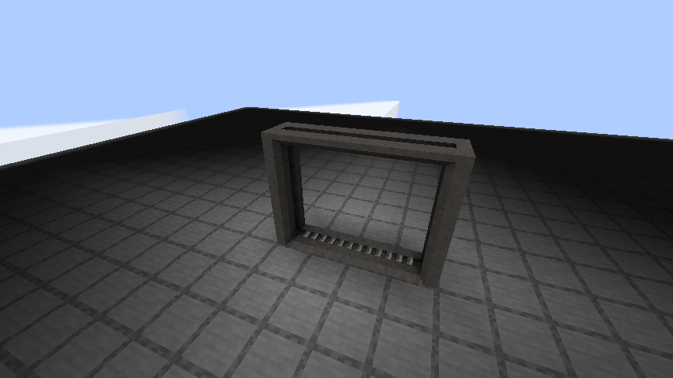
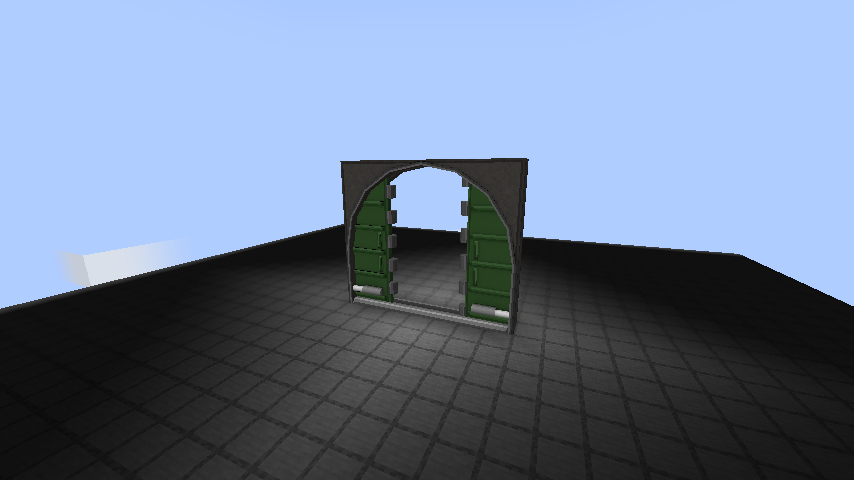
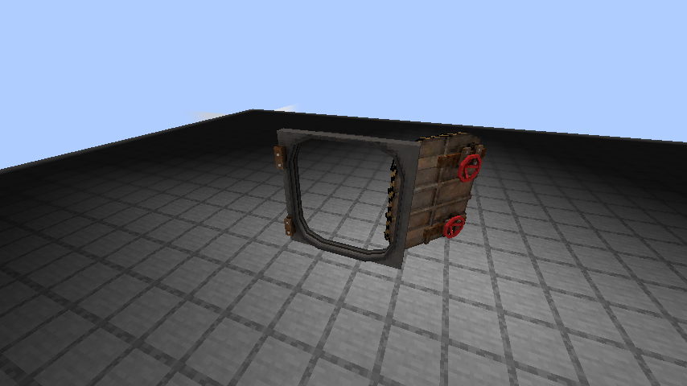
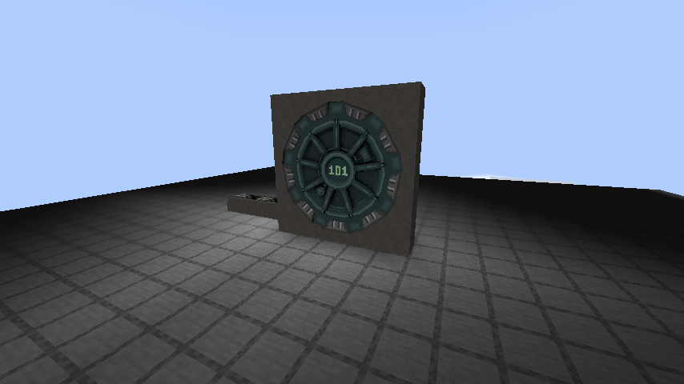

# Gameplay corrections — 1.2.0

Minecraft 1.20.1 / Forge 47.4.20 / Java 17. No HBM or other third-party runtime dependency.

| Reported issue | Change |
| --- | --- |
| Fire door sideways with invisible collision | Bake its mesh rotation and controller-relative offset before animation. Its rendered frame now occupies its structure footprint. Clip the retracting panel at the upper frame. |
| Large vehicle door sideways and leaves moving outside the frame | Correct mesh rotation and apply clipping to both sliding leaves in animated model coordinates. |
| QE sliding door cannot close | Preserve outline-only click targets on the upper rail and inner edges when open. The passage stays non-solid. |
| Secure-access door blocks the open passage | Remove the full-block lower collision row and align the upper collision with the sunken sill/top beam geometry. |
| Sliding steel door cannot close | Preserve clickable frame outlines separately from collision; clip the sliding panel as it retracts. |
| Vault center displays the texture atlas | Honor the Label part's dedicated numbered texture even where the OBJ switches its material back to `default`. |
| Water door sideways and detached animation | Bake the modern mesh into the coordinate system expected by its existing hinge and valve pivots. |
| Blast Door is a cube | Its existing registry entry now places the functional seven-block modular blast door. This is an alias of the 1.12-derived modular type, not a second distinct blast-door design. |
| Fusion Hatch, Seal Hatch and Steel Trapdoor are cubes | Replace the placeholder blocks with hand/redstone-operated, waterloggable single-block metal trapdoors using their existing textures. |

## Scope and remaining simplifications

The three small hatches use Minecraft trapdoor geometry and instant open/close transitions. Their old upstream entries were plain blocks; this update does not recreate reactor machinery or claim these are recovered original HBM hatch animations. Hatch sounds are metal.

Collision remains conservative during animated movement: most doors keep their closed collision until fully open. The click-target outlines for the two small sliding doors stay usable when open; use the frame/upper rail. Moving leaves outside a door's reserved structure are visual geometry, not separately solid world blocks.

The port still omits HBM access-control/keypad networks, power machinery, radiation/sealing simulation and unrelated systems as described in the dependency report. The modular blast door retains its linked-wall and pulse-redstone behavior.

## Upgrade

Replace the old standalone JAR; do not keep both versions in the mods folder. Install the same version on client and server. Existing animated door IDs and saved state are retained. Break and replace previously placed **Blast Door cubes**: old cubes have no controller/structure data, so they cannot become complete multiblocks merely by loading the new JAR. The three hatch cubes become the new trapdoor block states.

## Validation

- Production build and six Forge GameTests, including all 15 animated registry entries in four directions (60 lifecycle combinations), redstone, save/load, multiblock cleanup and linked blast-door behavior.
- The affected doors are placed through their real BlockItem placement path with the player facing each direction. Regression tests use Minecraft outline raycasts from both sides to click the open QE and steel frames, then check that the doors fully close. Player-sized collision boxes check open passages in all four directions for the six affected doorway types.
- Hand and redstone opening/closing tests for all three replacement hatches.
- A real isolated client world renders the 11 reported entries at closed, halfway and open states (33 screenshots). These are staged animation snapshots, not a manual playthrough or a shader-mod compatibility test.
- Asset references and production JAR contents checked. Test harnesses are excluded from the shipped JAR.

## In-world captures

