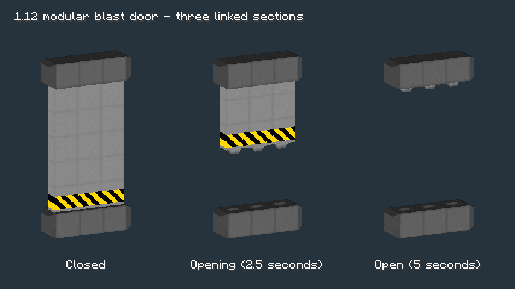

# HBM Doors Standalone

Minecraft **1.20.1**, Forge **47.4.20**, Java **17**. Install the built JAR in the `mods` folder on both the client and server. HBM, Architectury, Cloth Config, Create and other third-party mods are not required.

Includes 14 animated door/hatch types, three conventional doors, and three functional metal hatches. The formerly decorative Blast Door entry now places the modular blast door. Version **1.3.0** adds the global redstone-only setting described below. Version 1.2.0 fixes model alignment, animations, open-door targeting, collision, and the vault label; see [FIXES-1.2.0.md](FIXES-1.2.0.md).

The new **Modular Sliding Blast Door** from HBM 1.12 forms linked walls of seven-block-tall sections. See [PORT-112.md](PORT-112.md) for its pulse-redstone controls and crafting recipe.

With redstone-only mode disabled, right-click an animated door or its frame to open/close it. Supply redstone at the controller or any structure part to control it. Sneak-right-click an idle door to cycle through its original models/skins. Placement requires the full structure footprint to be free. Removing any part removes the whole door.

Fusion Hatch, Seal Hatch and Steel Trapdoor act as single-block metal trapdoors. Their hand controls also obey the global setting. They are functional replacements for upstream placeholders, rather than recovered HBM machine hatches. When manual controls are enabled, aim at the frame or upper rail of open QE and sliding steel doors to close them.

When upgrading, remove the previous standalone JAR. Break and replace old **Blast Door cubes** to construct their new multiblock structure; existing animated doors retain their IDs.

All items are in the **HBM Doors** creative tab. Each has a distinct vanilla-material crafting recipe in `src/main/resources/data/hbm_doors/recipes`. The namespace is `hbm_doors`; this does not convert existing HBM worlds or inventories.

## Global redstone-only setting

**Enabled by default in 1.3.0.** All 21 registered HBM door/hatch entries reject manual opening and closing, including clicks on multiblock parts and either half of a conventional door. Vanilla Minecraft doors and doors from other mods are unaffected. Sneak-clicking an animated door still changes its skin.

Forge creates `hbm_doors-server.toml` inside the world's `serverconfig` directory:

- Singleplayer: `saves/<world>/serverconfig/hbm_doors-server.toml`
- Dedicated server: `<world>/serverconfig/hbm_doors-server.toml`

```toml
redstoneOnly = true
```

Set it to `false` to restore hand controls. Stop the world/server before editing and reopen it afterward. This is one server-owned setting for all HBM doors in that world; Forge syncs it to clients when they join. To set defaults for future worlds, put the same file in the instance's `defaultconfigs` folder.

Redstone operation is unchanged: ordinary doors follow power, while the modular blast door (including the Blast Door alias) toggles on each rising pulse. An already open door is not forcibly closed when this setting is enabled; use its normal redstone controls to close it.

## Build and test

Set `JAVA_HOME` to a 64-bit JDK 17, then run:

```text
gradlew.bat build
gradlew.bat runGameTestServer
gradlew.bat runClient -PdoorSmokeTest
gradlew.bat runClient -PdoorWorldTest
```

On Linux/macOS use `bash gradlew` instead. First builds require Internet access for Gradle, Forge and Minecraft dependencies. The production JAR is written to `build/libs/hbm-doors-1.20.1-1.3.0.jar`. Tests live in the separate `gametest` source set and are excluded from this JAR. The optional client smoke test renders an inventory gallery, writes `run/door-gallery.png`, then closes Minecraft. The world test creates a separate flat test world, places the 11 reported entries, and saves closed/half-open/open screenshots in `run/world-preview`.

See [DEPENDENCY-REPORT.md](DEPENDENCY-REPORT.md) for scope, changes, limitations and validation. [UPSTREAM.txt](UPSTREAM.txt) pins the source commit. [ASSET-MANIFEST.json](ASSET-MANIFEST.json) inventories packaged resources; [UPSTREAM-DEPENDENCIES.json](UPSTREAM-DEPENDENCIES.json) records the original Java import graph.

This is an independent extraction, not an official HBM release. Original code/assets remain credited to the HBM-Modernized contributors and their upstream authors. Distributed under the repository's GPLv3 license; see [LICENSE](LICENSE) and [NOTICE](NOTICE).


